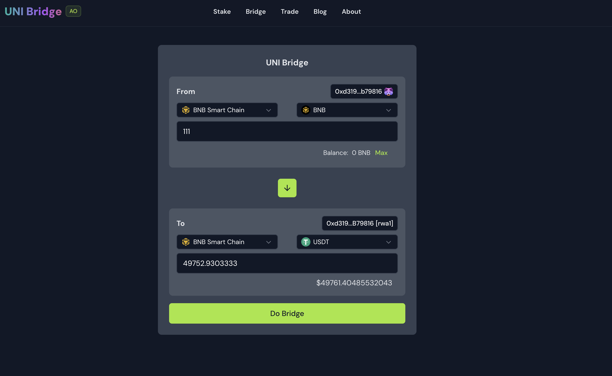
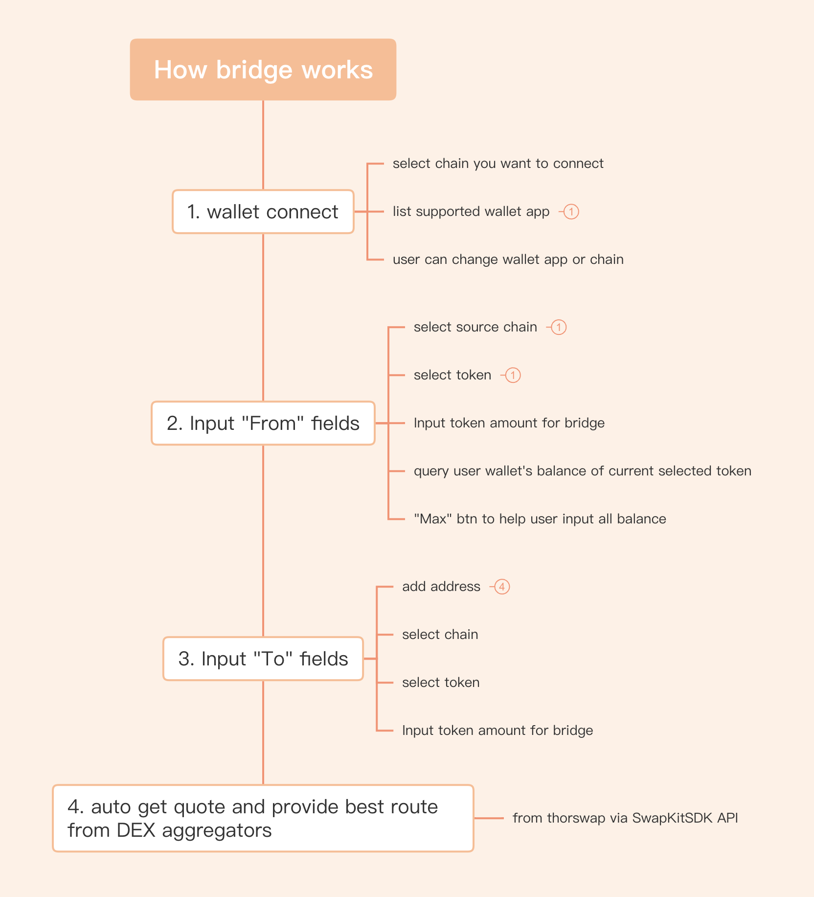
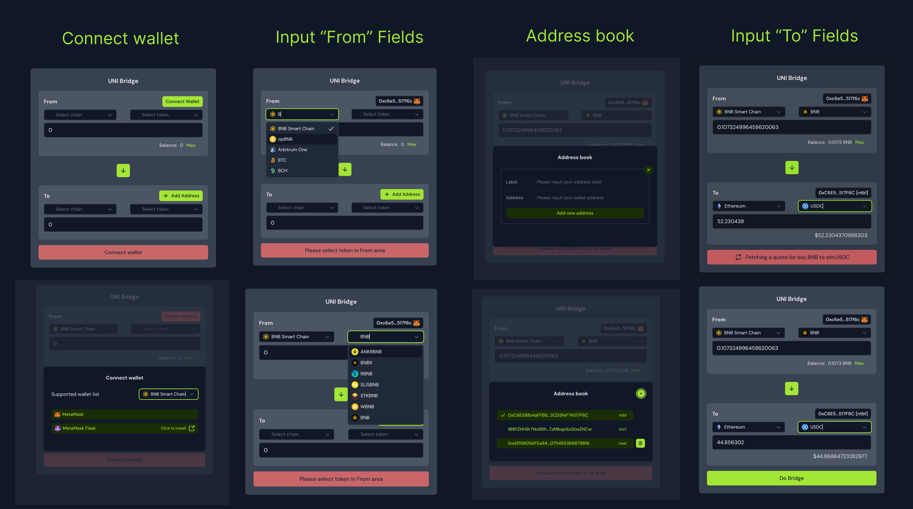

# UNI Bridge for All BlockChains

## Intro

UNI Bridge is a decentralized bridge for connecting different blockchains.

It includes stake, bridge, trade modules(Currently only the bridge module is available).

Our mission is to provide a decentralized bridge for connecting different blockchains and take over the centralized exchange platforms.


It allows users to transfer assets between all blockchains without having to use any centralized, currently support:

* Bitcoin
* Ethereum Mainnet
* BNB Smart Chain (BEP20)
* BNB Beacon Chain (BEP2)
* Avalanche C-Chain
* Cosmos (ATOM)
* THORChain
* Dogecoin
* Bitcoin Cash
* Litecoin

More chains ( Arweave, AO, Polygon, Solana) support are coming soon.

## Quick Link

* [Video demo](#) (WIP)
* [Online product link](https://ub.rwa-wallet.com/bridge)
* [All product screenshots](./screenshot)
* [Source code](https://github.com/HelloRWA/uni-bridge)
* [A bscscan log of the example of using Swapkit to make a swap on BSC chain](https://bscscan.com/tx/0x739059b894d0d31e9f05d87542431b39f681c5627e5a6a7120f9164bc3374fbe)

## How it works?

The bridge module leverages SwapkitSDK API to aggregate liquidity from various decentralized exchanges across different blockchains. This modules aims to provide users with the best possible trading rates, enhance liquidity, and simplify the cross-chain trading experience.



## Features

### 1. Multi-chain Liquidity Aggregation

* Aggregates liquidity from various decentralized exchanges across multiple blockchains.
  * Currently supported DEX aggregation routes: Uniswap V2 + V3, SushiSwap, 1Inch (ParaSwap, GMX, Curve), 0x Protocol (Matcha), Kyber, Pangolin, TraderJoe, WOOFi and PancakeSwap.
  * Currently supported Chains: Bitcoin, Ethereum Mainnet, BNB Smart Chain (BEP20), BNB Beacon Chain (BEP2), Avalanche C-Chain, Cosmos (ATOM), THORChain, Dogecoin, Bitcoin Cash, Litecoin.
  * Coming soon: Arweave, AO, Polygon, Solana
* Utilizes SwipKitSDK API to facilitate cross-chain swaps and ensure optimal trading rates.

### 2. Optimize trading experience

* Provide users with real-time quotes and trading opportunities.
* Minimize slippage and ensure efficient trade execution.
* [WIP] Aggregates more platforms to provide users with the best possible trading rates.

### 3. User-friendly interface

* Intuitive interface for seamless bridge and liquidity management.
* Good UX and UI design by the Nuxt UI framework.

### 4. [WIP] Users can earn affiliate fees for share bridge to earn

Our platform will allows KoLs to have invite code and links to track their referral earnings on their social platform.

## SwapkitSDK Integration

The bridge module uses the SwapKitSDK to handle cross-chain liquidity aggregation and bridge.

## What we build during the hackathon?




TODO: list the UI/UX features and screenshots here

* [x] A bridge module to aggregate liquidity from various decentralized exchanges across multiple blockchains.
* [x] A user-friendly interface for seamless bridge and liquidity management.
* [x] A simple and intuitive interface for seamless bridge and liquidity management.
* [x] Uni Connect modules
  * [x] connect wallet btn
  * [x] connect wallet modal
    * [x] user can see a list of supported chains
    * [x] user can select a chain
      * [x] list corresponding wallet app (filter by the tag of the chain)
      * [x] auto detect all the supported wallet app is installed or not
        * [x] if not installed: user can click the "Click to install" btn to install the missing wallet app
        * [x] if installed: user can click wallet btn to connect with the wallet app

## What's next?

* [ ] Stake module
* [ ] Trade module
* [ ] More chains support
* [ ] More wallet support
* [ ] Integrated into [RWA-Wallet.com chrome extention](https://chromewebstore.google.com/detail/rwa-wallet/fhmmkjofdcpnoklcbcnbjjhigobceikb)


## Technical Stack

* **Frontend**: Vue.js, Nuxt.js, NuxtUI, NuxtUI-Pro, Tailwindcss
* **Backend**: Supabase.js, Node.js, Nitro.js(build-in Nuxt.js)
* **Blockchain** Integration: SwapKitSDK, [Layer SaaS](https://www.npmjs.com/package/@web3-fullstack/layer-saas)
* **Database**: PostgreSQL (Supabase.js build-in)
* **Deployment**: Vercel


## Setup

Make sure to install the dependencies:

```bash
# npm
npm install

# pnpm
pnpm install

# yarn
yarn install

# bun
bun install
```

## Development Server

Start the development server on `http://localhost:3000`:

```bash
# npm
npm run dev

# pnpm
pnpm run dev

# yarn
yarn dev

# bun
bun run dev
```

## Production

Build the application for production:

```bash
# npm
npm run build

# pnpm
pnpm run build

# yarn
yarn build

# bun
bun run build
```

Locally preview production build:

```bash
# npm
npm run preview

# pnpm
pnpm run preview

# yarn
yarn preview

# bun
bun run preview
```

Check out the [deployment documentation](https://nuxt.com/docs/getting-started/deployment) for more information.

## Renovate integration

Install [Renovate GitHub app](https://github.com/apps/renovate/installations/select_target) on your repository and you are good to go.
